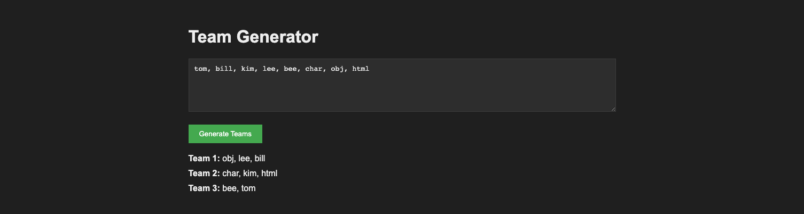

# pro-team-gen
      
## Description

team generator website that allows users to input a list of team members, and then randomly generates teams of 2 or 3 by clicking the "Generate Teams" button. The generated teams are displayed below the input form.

## Table of Contents

- [Installation](#installation)
- [Usage](#usage)
- [Credits](#credits)
- [License](#license)

## Installation

- [Project repo](https://github.com/shaynefw/pro-team-gen)
- [Project deployed link](https://shaynefw.github.io/pro-team-gen/)
- [Project Video Demo]()

## Usage

## Credits

## License

## Badges

## Features

## How to Contribute

## Tests

## Questions
  
If you have any questions you can reach me by...
  